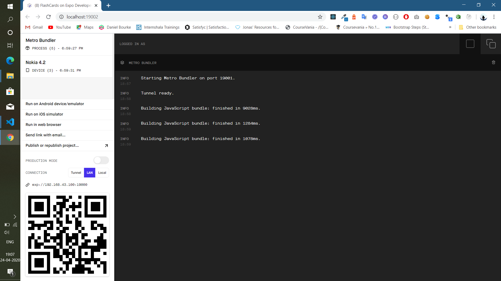

# Mobile Flashcards

<br/>
The Mobile Flashcards app is the 3rd and final project required for the Udacity React Nanodegree program. 
This is a React Native app so the same codebase is used to create packages for both Androids and iOS. 
The app has been tested on Androids physical devices using Expo.

The Mobile Flashcards app provides features similar to typical index cards used for studying. 
The app allows the user to create decks. Each deck contains a set of cards with a question and an answer.
The user can start a quiz for a given deck and evaluate themselves for correct or incorrect answers.
Users are given a score at the end of completing a quiz session.


## Technical Specs

The app uses the following packages:

## Note:
  - Node 
    - the node needs a downgraded version 10.18.0 due to compatibility issues with expo 
    - node versions 12.x and 14.x generates the error


### Core:
- react
- react-native
- expo

### Navigation:
- react-navigation
- react-navigation-material-bottom-tabs
- react-navigation-stack
- react-native-paper

### State Management:
- redux
- react-redux

### Styling:
- react-native-vector-icons

## Installation

1. You need to have Node.js, npm and yarn installed
2. Proceed by cloning or downloading the project as a zip
3. Extract and change directory to the project folder
4. Open your Terminal or Command prompt and type ```yarn install```
5. Then type ```yarn start```
6. Your default browser will open with the Metro Bundler running at port 19002 with the address: http://localhost:19002/



## How to Run the App
The app has been tested on both Android and iOS physical devices 

- Install Expo https://expo.io/ on both Android and iOS
- All your devices (computer running the Metro Bundler, Android and iOS device) should be connected on the same local area network

### Android
1. Go to the Play Store and install Expo
2. Run Expo on the device
3. Scan the QR code available on the browser running the Metro Bundler
4. The Flashcards app should start 

### iOS
1. Go to the Apple Store and install Expo
2. Run Expo on the device
3. You can't scan the QR code on iOS, so you will have to either "Send link with email" or copy paste the link exp://192.168.0.109:19000 in Safari running on iOS
   - The network address may vary depending on your local area network setup so you might get something like exp://172.16.1.2:19000
   - Please look at the browser running the Metro Bundler, the link should be will be available under CONNECTION - please see the screenshot above
   - Safari will ask permission to open the app in Expo: Open this page in "Expo"? Click Open
4. The Flashcards app should now start

## Flashcards App

Screenshots below show the app running on Android Devices side by side.


### Splash Screen 


### Decks


Decks view is also the home view, once you start the app you get the default Decks view. 
The first time you run the app, you will get 3 decks created by default:

- JavaScript
- React
- Node Js

Feel free to delete these decks or create your own.

### New Deck


You can create your own Decks by touching the New Deck tab. 

### Individual Deck


Clicking on deck from the decks listing view shows the individual Deck view.

Here you can:
- Add a card to the deck
- Start a quiz

### Add New Card to Deck


A deck card is the equivalent of the flash card or index card used for studying or exam preparation.

A deck card consists of:
- a question
- an answer

### Quiz


A quiz can be started on any deck as long as there is at least one card.
The quiz will run through all the cards in the deck. 

you can click show answer to see the question answer

### Quiz Result & Score


The quiz result with the score is shown when the user has gone through all the quiz questions.

if user's score below 50% upset face shows otherwise smile face shows
